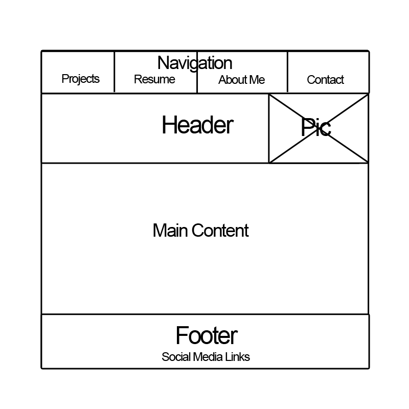
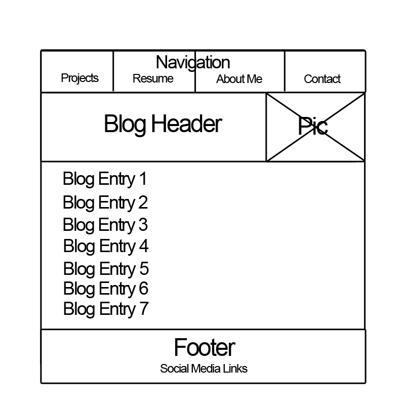

##Index Wireframe

##Blog Wireframe

##What is a wireframe?

>A wireframe is a super-simplified layout of a website's design. It can be as simple as a pencil sketch or as elaborate as demonstrating multiple levels of navigation and using grayscale colors to highlight certain areas. It's important to not go too elaborate, though, or else you lose the speed and simplicity benefits of the wireframe.

##What are the benefits of wireframing?

>By stripping away all content, the designer is forced to look at the organization of the page. Using simple boxes and text, it makes the hierarchy of information and materials extremely clear. The simplicity also allows designers to quickly modify the wireframe and makes generating a large number of them for a site quick and easy. This means wireframing is a low-cost way to try a lot of interesting failed experiments before settling on a working wireframe.

##Did you enjoy wireframing your site?

>At times? I tried a whole bunch of ideas, but I got a little intimidated by trying to make this project fit in with the overall larger project of building a portfolio site with additional challenges in the future and worried about trying something too strange or difficult to implement. Ultimately I wound up going with some pretty conservative choices, and I have mixed feelings about that.

##Did you revise your wireframe or stick with your first idea?

>I did a bunch of revisions through the process, including revising between paper and the final images of boxes I made in Photoshop. 

##What questions did you ask during this challenge? What resources did you find to help you answer them?

>I asked myself a lot of questions about what I thought future assignments might require from me to build out on the site -- trying to guess ahead at the number and types of navigation objects I'd need, for example. This resource wasn't necessarily helpful to those questions in particular, but it was interesting: [Paper Wireframing](http://www.mstoner.com/blog/uncategorized/pwireframing_paper_wireframing/).

##Which parts of the challenge did you enjoy and which parts did you find tedious?

>I really enjoyed the loose doodling part of the challenge, but I found the actual deciding on a workable wireframe tedious. I backed off from some kind of interesting ideas because I wanted to do the assignment the "right" way (I know, I know!). Doing a prettier version of an idea I was only so-so about was a little tedious, but I think it should be workable. 
