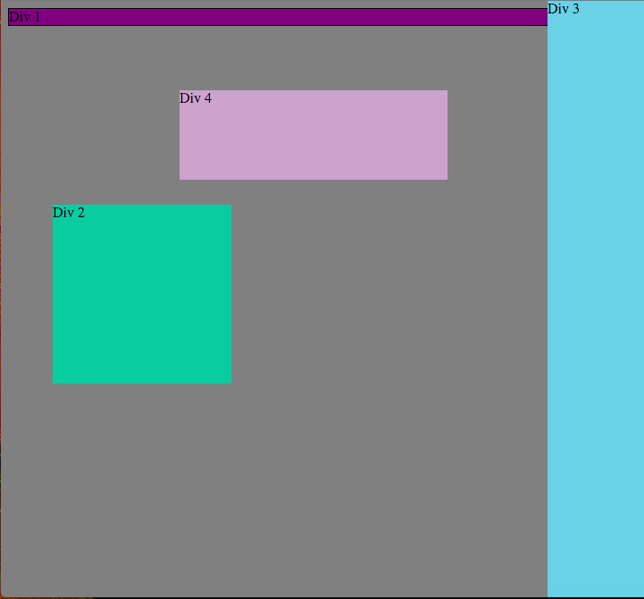

##1. Change the Colors

##2. Column

##3. Row

##4. Make Equidistant

##5. Squares

##6. Footer

##7. Header

##8. Sidebar

##9. Get Creative

##How can you use Chrome's DevTools inspector to help you format or position elements?

>Chrome's DevTools allows you to see real-time results of making edits to individual elements' CSS. This makes it very easy to make small tweaks and see the results instantly.

##How can you resize elements on the DOM using CSS?

>You can identify the specific elements in CSS and then set their width and height values. You can also increase the size elements take up by adding additional padding. You can access these elements through Chrome DevTools in an easy to use representation of the DOM's tree structure.

##What are the differences between absolute, fixed, static, and relative positioning? Which did you find easiest to use? Which was most difficult?

>**Absolute positioning** lets you place an element exactly on the page by specifying the pixels where it should fall in relation to its first parent element that has a position value (so long as that parent element isn't positioned static). **Fixed positioning** takes values that are fixed relative to the browser window. This means these elements will stick to the window as you scroll. **Static positioning** means that the elements will render where they should normally fall in the document. **Relative positioning** takes values that will move the element relative to where it should normally be. This means you can nudge an elements position after all the other element positions have been worked out.

>I find relative and fixed positioning are the easiest to use and to wrap my head around. Static positioning doesn't seem that useful unless you're trying to prevent other CSS properties from acting on it. Absolute positioning seems the most difficult to work out how to plan for, especially since I still feel I only have a rough idea of how and when to use it.

##What are the differences between margin, border, and padding?

>Margin is the amount of space around but not included in an element. Border is the line between margin and padding. Padding is the amount of space between the border and the element. Think of it like a bullseye with the content of the element in the center of the bullseye, the next ring would be padding, then the next ring would be border, and the final ring would be margin.

##What was your impression of this challenge overall? (love, hate, and why?)

>I really enjoyed this challenge. The simple series of goals all built on each other, which made it enjoyable to learn each part and how it fit in with what we had done earlier.