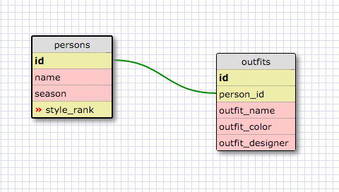

SELECT * FROM states;

SELECT * FROM regions;

SELECT state_name, population FROM states;

SELECT state_name, population FROM states ORDER BY population DESC;

SELECT state_name FROM states WHERE region_id = 7;

SELECT state_name, population_density FROM states WHERE population_density > 50 ORDER BY population_density ASC;

SELECT state_name FROM states WHERE population > 1000000 AND population < 1500000;

SELECT state_name, region_id FROM states ORDER BY region_id ASC;

SELECT region_name FROM regions WHERE instr(region_name, 'Central') > 0;

SELECT regions.region_name, states.state_name FROM states INNER JOIN regions ON states.region_id=regions.id ORDER BY states.region_id;

##What are databases for?

Hashes, objects and arrays are good for handling small amounts of data, but don't grow well to store giant amounts of information. Databases are an easier way to store, search, and navigate large amounts of data.

##What is a one-to-many relationship?

A one-to-many relationship is similar to a parent-child relationship in objects where an object can only have one parent but many children. The one in the "one-to-many" works like the parent and the many works like the children. Or if that doesn't work, it might help to think of it in terms of albums and bands. Each album is made by one band (please overlook compilations for the purposes of this analogy), and each band makes many albums (please overlook bands that flamed out after one album). The albums can't exist without a band to make them, and the band isn't really a band unless it has some albums.

##What is a primary key? What is a foreign key? How can you determine which is which?

A primary key is the unique identifier for each row in a database. The unique key can vary depending on the type and scope of the database you're constructing, but could be as simple as first_name if you're in a group where no one will be added where everyone has unique names or as elaborate as Social Security Numbers. There are also synthetic primary keys which are automatically incrementing integers that are produced by the database by adding a row. They're called "synthetic" because they don't refer to any actual properties of the item in the database -- they're arbitrary but assigned in order.

A foreign key is a key in a table that represents a row in some other table. The foreign key is like a footnote to the main (or parent) table, fleshing out some additional information on that parent table. The foreign key values, then, need to identify particular rows in the parent table that they're providing the specific additional information about.

You can spot the difference between a foreign key and a primary key because every value of a primary key must be unique, while foreign keys can repeat. To return to the bands-albums analogy: only one album can have a unique serial number (primary key), but many albums can have the foreign key that identifies them as being recorded by The Ramones.

##How can you select information out of a SQL database? What are some general guidelines for that?

To select information from an SQL database, you use the SQL command SELECT followed by the columns you want to be returned. Each column you want returned must be comma separated from the next. Once you've specified the columns you want, you need to use FROM to specify the specific tables you're calling on to select the columns from. Once all that's established, you can begin adding the additional constraints to narrow down your query.

##Schema
