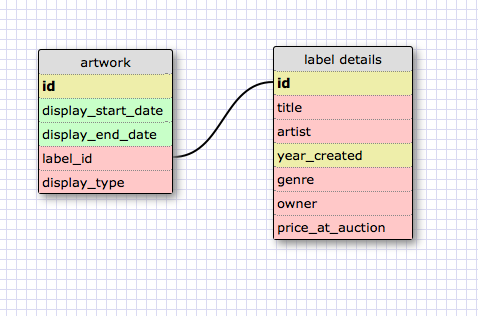

##One to One

This relationship is one-to-one because each artwork in this ficitonal museum can have only one label and only one label can refer to each artwork. Some of the fields in the label could be NULL -- you might even have some artwork that you could leave unlabeled.

##Many to Many

##What is a one-to-one database?

A one to one-to-one database models some kind of relationship where each item in one table is paired with only one item in another table.

##When would you use a one-to-one database? (Think generally, not in terms of the example you created).

You would use a one-to-one database when specifically working with pairs of items where each of one table will only apply to one of another table. Another thing that might help consider how this relationship works is asking if one of the pairs is full of optional fields or characteristics.

##What is a many-to-many database?

A many-to-many database represents the relationship between things where a lot of items will have a relationship with a lot of items in a different table. The model then requires a join table between the two tables that connects the ids of one table to the ids of the other table.

##When would you use a many-to-many database? (Think generally, not in terms of the example you created).

A many-to-many database is a relationship from many in a table to many other items in another table. This is a very common relationship as many items have many attributes and many connections to many other items, but it is difficult to implement.

##What is confusing about database schemas? What makes sense?

What's confusing about database schemas to me is that while the terminology seems strict during specific examples provided, when I tried coming up with my own examples, I saw how most of them could break down into other relationships. Actual facts and their relationships to each other seems much more slippery. What makes sense, though, is that you're basically creating a giant analogy for the information's use. The reason that constructing examples from thin air seems difficult is that you have to take into consideration how the data will be used in order to think about best practices for storing that data. This means it winds up being much easier to identify a working example's relationship type than it is to know a specific relationship that is only one relationship and not any other.